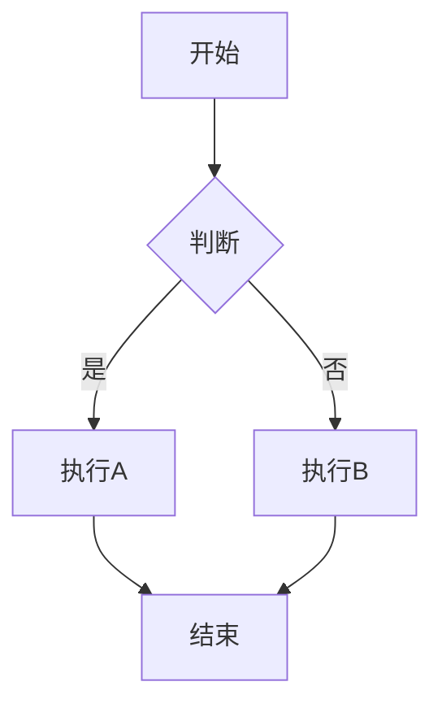

# Hexo Stellar 主题使用指南
本博客使用的是[Hexo](https://hexo.io/)搭建的，使用了[Hexo主题](https://hexo.io/themes/)中的[Stellar](https://github.com/xaoxuu/hexo-theme-stellar)主题。

[Stellar](https://github.com/xaoxuu/hexo-theme-stellar)主题是一个功能极其丰富的综合型 Hexo 主题，包含博客系统、知识库系统、专栏系统、笔记系统，内置海量的标签和动态数据组件。它不仅支持传统的博客写作，还提供了文档管理、知识库、专栏系统等高级功能，特别适合技术博客、知识分享和个人品牌建设。

<!--more-->

## 环境要求

在开始使用 Stellar 主题之前，请确保您的环境满足以下要求：

```yaml
Hexo: 6.3.0 ~ latest
hexo-cli: 4.3.0 ~ latest
node: 14.17.3 ～ latest LTS # 建议选择 LTS 版本
npm: 6.14.13 ~ latest
```

## 安装配置

### 1. 安装主题

```bash
# 在 Hexo 根目录下安装主题
npm install hexo-theme-stellar
```

### 2. 启用主题

在 `_config.yml` 中设置主题：

```yaml
theme: stellar
```

### 3. 创建主题配置文件

创建 `_config.stellar.yml` 文件来配置主题：

```bash
# 复制主题默认配置
cp node_modules/hexo-theme-stellar/_config.yml _config.stellar.yml
```

## 基础配置

### 站点基本信息

在 `_config.yml` 中配置站点基本信息：

```yaml
# Site
title: 我的博客
subtitle: '一行字|A line of code'
description: 这是我的个人博客
author: 您的名字
language: zh-CN
timezone: 'Asia/Shanghai'

# URL
url: https://your-domain.com
permalink: :year/:month/:day/:title/
permalink_defaults:
pretty_urls:
  trailing_index: true
  trailing_html: true
```

### 主题基础配置

在 `_config.stellar.yml` 中配置主题：

```yaml
# Logo 配置
logo:
  avatar: '[{config.avatar}](/about/)'
  title: '[{config.title}](/)'
  subtitle: '{config.subtitle}'

# 样式配置
style:
  prefers_theme: auto # auto / light / dark
  smooth_scroll: true
  font-size:
    root: 16px
    body: 17px
    code: 85%
```

## 博客系统使用

### 创建博客文章

使用 Hexo 命令创建新文章：

```bash
hexo new post "文章标题"
```

### 文章 Front-matter 配置

Stellar 主题支持丰富的 Front-matter 配置选项：

```yaml
---
# 基本信息
title: 文章标题
date: 2025-01-01 12:00:00
tags: [标签1, 标签2] # 文章的标签
categories: [分类1, 分类2] # 文章的分类
description: 文章描述 # 或使用 excerpt

# 封面和横幅
cover: /images/cover.jpg # 封面小图
banner: /images/banner.jpg # 文章顶部大图

# 海报（可选）
poster:
  topic: 专栏名称 # 标题上方的小字
  headline: 大标题 # 必选
  caption: 标题下方的小字 # 可选
  color: '#FF6B35' # 标题颜色

# 功能开关
sticky: 1 # 置顶，数字越大越靠前
comments: true # 是否允许评论
indexing: true # 是否被搜索索引
breadcrumb: true # 是否显示面包屑导航

# 页面布局
type: tech # tech: 技术类文章, story: 故事类文章
leftbar: recent, related # 左侧栏组件
rightbar: toc, ghrepo # 右侧栏组件
h1: 文章标题 # 设置为 '' 隐藏标题

# 专栏和作者
topic: blogtool # 专栏 id
author: author_name # 作者 id

# 数学公式和图表
mermaid: true # 启用 Mermaid 图表
katex: true # 启用 KaTeX 数学公式
mathjax: true # 启用 MathJax 数学公式
---

文章摘要，会显示在列表页面。
<!-- more -->

文章正文内容...
```

### 文章类型说明

Stellar 支持两种文章类型：

- **tech**：技术类文章，适合代码和技术文档，代码块样式更突出
- **story**：故事类文章，文字间距更大，适合阅读体验

### 页面管理

#### 创建普通页面

```bash
hexo new page "about"
```

页面 Front-matter：

```yaml
---
title: 关于我
date: 2025-01-01 12:00:00
layout: page
menu_id: 关于 # 高亮的菜单项
---
```

#### 自定义页面布局

```yaml
---
title: 自定义页面
layout: page
leftbar: recent
rightbar: toc
---
```

## Wiki文档系统使用

Wiki 系统是 Stellar 主题的核心功能之一，适合构建知识库和项目文档。根据源码分析，Wiki 系统通过数据文件配置和页面关联来实现项目管理。

### Wiki 系统工作原理

Wiki 系统通过以下机制工作：

1. **项目配置管理**：在 `source/_data/wiki/` 目录下创建项目配置文件
2. **页面关联**：通过页面的 `wiki` 字段关联到具体项目
3. **自动生成**：通过 `wiki.js` generator 自动生成 Wiki 列表页面
4. **项目分类**：支持通过标签对项目进行分类
5. **页面树构建**：根据配置的 `tree` 结构构建页面导航

### 创建 Wiki 文档系统

#### 第一步：创建项目配置文件

在 `source/_data/wiki/` 目录下创建项目配置文件，例如 `my-project.yml`：

```yaml
title: 我的项目
description: 项目文档
icon: solar:document-2-bold-duotone
color: '#3DC550'
tags: [前端, 教程]  # 项目标签，用于分类
sort: 1  # 排序权重，数字越大越靠前
base_dir: wiki/my-project/  # 项目页面基础路径
tree:  # 页面树结构配置
  "基础": ["index", "getting-started"]
  "高级": ["advanced", "deployment"]
homepage: index  # 指定首页，可选
```

#### 第二步：创建 Wiki 页面

在 `source/wiki/my-project/` 目录下创建页面文件：

```bash
# 创建项目页面
hexo new page "wiki/my-project/index"
hexo new page "wiki/my-project/getting-started"
hexo new page "wiki/my-project/advanced"
```

#### 第三步：配置页面 Front-matter

每个 Wiki 页面需要配置相应的 Front-matter：

```yaml
---
title: 快速开始
wiki: my-project  # 关联到项目配置
layout: wiki      # 使用 wiki 布局
---
```

#### 第四步：配置 Wiki 上架

在 `source/_data/wiki.yml` 中配置要显示的项目：

```yaml
# 上架的项目列表，只有在此列表中的项目才会在 Wiki 首页显示
- my-project
- another-project
```

### Wiki 页面结构示例

```text
source/
├── _data/
│   ├── wiki/
│   │   └── my-project.yml        # 项目配置
│   └── wiki.yml              # Wiki 上架配置
└── wiki/
    └── my-project/
        ├── index.md              # 项目首页
        ├── getting-started.md    # 基础页面
        └── advanced.md          # 高级页面
```

### Wiki 系统特性

1. **项目卡片展示**：在 Wiki 首页以卡片形式展示所有上架项目
2. **标签分类**：支持通过标签对项目进行分类筛选
3. **页面树导航**：根据配置的 `tree` 结构生成页面导航
4. **自动首页**：未指定 `homepage` 时，自动选择 TOC 第一页作为首页
5. **相关项目推荐**：基于标签推荐相关项目

注意：
1. **页面路径匹配**：确保页面文件路径与 `base_dir` + `tree` 配置匹配
   ```yaml
   # 配置
   base_dir: wiki/my-project/
   tree:
     '基础': ['index', 'getting-started']
   
   # 对应的页面文件
   source/wiki/my-project/index.md
   source/wiki/my-project/getting-started.md
   ```
2. **多个页面**：Tree 组件只有在项目有多个页面时才会显示，单个页面不会显示导航树

## 笔记本系统使用

笔记本系统适合管理学习笔记和知识整理，通过标签树结构实现层级化管理。

### 笔记本系统工作原理

笔记本系统通过以下机制工作：

1. **笔记本配置**：在 `source/_data/notebooks/` 目录下配置笔记本
2. **标签树管理**：使用层级标签实现笔记分类
3. **自动生成**：通过 generator 自动生成笔记本列表页面
4. **标签云展示**：自动生成标签云和标签树

### 创建笔记本系统

#### 第一步：创建笔记本配置

在 `source/_data/notebooks/` 目录下创建笔记本配置文件，例如 `hexo.yml`：

```yaml
title: Hexo 学习笔记
description: Hexo 相关学习笔记
icon: solar:notebook-bookmark-bold-duotone
color: '#FA6400'
menu_id: notes
leftbar: tagtree, recent
rightbar: toc
```

#### 第二步：创建笔记文章

使用标准的 Hexo 命令创建文章：

```bash
hexo new post "Hexo 基础教程"
```

#### 第三步：配置笔记 Front-matter

在笔记的 Front-matter 中指定笔记本：

```yaml
---
title: Hexo 基础教程
notebook: hexo
tags: [Hexo/基础, Hexo/教程]
---
```

### 标签树结构使用

笔记本系统支持层级标签，使用 `/` 分隔符：

```yaml
tags: [Hexo/基础/安装, Hexo/配置/主题, JavaScript/ES6/箭头函数]
```

这会生成如下的标签树结构：

```text
Hexo
├── 基础
│   └── 安装
├── 配置
│   └── 主题
JavaScript
└── ES6
    └── 箭头函数
```

### 笔记本系统特性

1. **层级标签**：支持多级标签分类
2. **标签云**：自动生成可视化标签云
3. **标签树**：侧边栏显示层级标签树
4. **笔记统计**：显示每个标签下的笔记数量

## 专栏系统使用

专栏系统适合系列文章管理，通过 topic 配置实现文章分组。

### 专栏系统工作原理

专栏系统通过以下机制工作：

1. **专栏配置**：在 `source/_data/topic/` 目录下配置专栏
2. **文章关联**：通过 `topic` 字段关联文章到专栏
3. **专栏页面**：自动生成专栏列表页面
4. **文章分组**：在专栏页面中按时间或分类显示文章

### 创建专栏系统

#### 第一步：创建专栏配置

在 `source/_data/topic/` 目录下创建专栏配置文件，例如 `blogtool.yml`：

```yaml
title: 博客工具
description: 博客相关工具使用教程
icon: solar:documents-bold-duotone
color: '#1BCDFC'
menu_id: post
leftbar: recent, related
rightbar: toc
```

#### 第二步：创建专栏文章

创建文章时在 Front-matter 中指定专栏：

```yaml
---
title: Hexo 主题配置
topic: blogtool
layout: post
---
```

### 专栏系统特性

1. **文章分组**：自动将同专栏文章分组显示
2. **专栏导航**：在专栏页面显示所有相关文章
3. **系列标识**：在文章页面显示所属专栏信息
4. **统计信息**：显示专栏文章数量等统计信息

## 菜单配置

菜单栏是 Stellar 主题的核心导航组件，位于左侧边栏顶部。

### Menubar 配置

在 `_config.stellar.yml` 中配置菜单：

```yaml
menubar:
  columns: 4 # 一行显示多少个菜单项
  items: # 菜单项列表
    - id: post # 页面中高亮的 menu_id
      theme: '#1BCDFC' # 高亮时的颜色
      icon: solar:documents-bold-duotone # 图标
      title: 博客 # 标题
      url: / # 跳转链接
    - id: wiki
      theme: '#3DC550'
      icon: solar:document-2-bold-duotone
      title: 文档
      url: /wiki/
    - id: notes
      theme: '#FA6400'
      icon: solar:notebook-bookmark-bold-duotone
      title: 笔记
      url: /notebooks/
    - id: 关于
      theme: '#F44336'
      icon: solar:backpack-bold-duotone
      title: 关于
      url: /about
```

### 菜单高亮逻辑

Stellar 主题的菜单高亮遵循以下优先级：

#### 第一优先级：页面 Front-matter

```yaml
---
title: 我的文章
menu_id: wiki  # 直接指定高亮哪个菜单
---
```

#### 第二优先级：笔记本配置

```yaml
# 在笔记本配置中指定
notebook:
  menu_id: notes
```

#### 第三优先级：页面类型自动判断

- 博客文章 → `post`
- 专栏文章 → `post`
- 文档页面 → `wiki`
- 笔记页面 → `notebooks`
- 笔记本列表 → `notebooks`
- 作者页面 → `post`
- 404页面 → `post`

### 自定义图标

在 `source/_data/icons.yml` 中定义自定义图标：

```yaml
# 自定义图标
custom:my-icon: <svg xmlns="http://www.w3.org/2000/svg" width="32" height="32" viewBox="0 0 24 24">
  <path fill="currentColor" d="..."/>
</svg>
```

**图标要求**：

- 尺寸：`width="32" height="32"`
- 颜色：使用 `fill="currentColor"` 以支持主题色
- 移除硬编码的颜色属性

## 侧边栏配置

### 侧边栏组件

Stellar 提供了丰富的侧边栏组件：

#### 左侧栏组件

```yaml
# _config.stellar.yml
site_tree:
  post:
    leftbar: recent, related, tagtree # 博客文章左侧栏
  wiki:
    leftbar: tree, related, recent # 文档页面左侧栏
```

#### 右侧栏组件

```yaml
site_tree:
  post:
    rightbar: toc, ghrepo # 博客文章右侧栏
  wiki:
    rightbar: toc, ghrepo # 文档页面右侧栏
```

#### 可用组件列表

| 组件名     | 功能        | 说明           |
| ---------- | ----------- | -------------- |
| `welcome`  | 欢迎信息    | 个性化欢迎组件 |
| `recent`   | 最近更新    | 显示最新文章   |
| `related`  | 相关文章    | 智能推荐文章   |
| `tagtree`  | 标签树      | 层级标签展示   |
| `tagcloud` | 标签云      | 可视化标签     |
| `toc`      | 目录        | 文章目录导航   |
| `tree`     | 页面树      | 上下篇文章     |
| `ghrepo`   | GitHub 仓库 | 仓库信息展示   |
| `ghuser`   | GitHub 用户 | 用户信息展示   |
| `timeline` | 时间线      | 动态时间线     |
| `author`   | 作者信息    | 作者卡片       |

### 组件配置示例

```yaml
# _config.stellar.yml
widgets:
  recent:
    layout: recent
    limit: 10 # 显示数量
    rss: /atom.xml # RSS 源
  
  tagcloud:
    layout: tagcloud
    title: 标签云
    min_font: 12
    max_font: 24
    amount: 100
    color: true # 使用颜色
  
  timeline:
    layout: timeline
    title: 近期动态
    api: https://api.github.com/repos/user/repo/issues
    limit: 20
```

## 插件功能

### 数学公式支持

#### KaTeX 配置

```yaml
# _config.stellar.yml
plugins:
  katex:
    enable: true
    copy_tex: true
    mhchem: true
```

在文章中使用：

```yaml
---
katex: true
---
```

#### MathJax 配置

```yaml
plugins:
  mathjax:
    enable: true
    config:
      tex2jax:
        inlineMath: [['$','$'], ['\\(','\\)']]
        displayMath: [['$$','$$'], ['\\[','\\]']]
```

### Mermaid 图表

```yaml
plugins:
  mermaid:
    enable: true
    theme: neutral
```

使用：



### 评论系统

支持多种评论服务：

#### Beaudar 配置

```yaml
# _config.stellar.yml
comments:
  service: beaudar
  beaudar:
    repo: username/repo
    issue_term: pathname
    theme: github-light
```

#### Utterances 配置

```yaml
comments:
  service: utterances
  utterances:
    repo: username/repo
    issue_term: pathname
    theme: github-light
```

#### Giscus 配置

```yaml
comments:
  service: giscus
  giscus:
    repo: username/repo
    repo_id: repo_id
    category_id: category_id
    mapping: pathname
    theme: light
```

### 搜索功能

#### 本地搜索

```yaml
# _config.stellar.yml
search:
  service: local
  local:
    enable: true
    path: search.json
    field: post,page
    content: true
    format: html
```

#### Algolia 搜索

```yaml
search:
  service: algolia
  algolia:
    appId: your_app_id
    apiKey: your_api_key
    indexName: your_index_name
```

## 自定义样式

### 主题色配置

```yaml
# _config.stellar.yml
style:
  color:
    theme: 'hsl(192 98% 55%)'    # 主题色
    accent: 'hsl(14 100% 57%)'   # 强调色
    link: 'hsl(207 90% 54%)'     # 链接色
```

### 字体配置

```yaml
style:
  font-family:
    body: 'system-ui, "Microsoft Yahei", "Segoe UI", Arial, sans-serif'
    code: 'Menlo, Monaco, Consolas, system-ui, monospace, sans-serif'
  font-size:
    root: 16px
    body: 17px
    code: 85%
```

### 圆角配置

```yaml
style:
  border-radius:
    card-l: 24px    # 侧边栏、文章横幅
    card: 16px      # 文章内卡片
    card-s: 12px    # 小型卡片
    bar: 8px        # 横条元素
    image-l: 24px   # 非技术类文章插图
    image: 16px     # 技术类文章插图
```

### 自定义 CSS

创建 `source/css/_custom.styl` 文件：

```stylus
// 自定义样式
.custom-class
  color: var(--theme)
  font-weight: bold

// 覆盖主题样式
.nav-item
  border-radius: 12px
```

## 标签组件


### Note 标签



### Box 标签


正文，也可以指定[color:color] [child:codeblock/tabs]


### 折叠
```

content

```

就像这样：


```python
# 这里是代码块
def hello():
    print("Hello, World!")
```



<!-- folder 题目1 -->
这是答案1
<!-- folder 题目2 -->
这是答案2
<!-- folder 题目3 -->
这是答案3


### grid
```

<!-- cell -->
一个单元格
<!-- cell -->
另一个单元格

```


<!-- cell -->
一个单元格
<!-- cell -->
另一个单元格


### tab



<!-- tab 图片 -->


<!-- tab 代码块 -->
```swift
let x = 123
print("hello world")
```

<!-- tab 表格 -->
| a | b | c |
| --- | --- | --- |
| a1 | b1 | c1 |
| a2 | b2 | c2 |



### timeline
```

<!-- node 时间点1 -->
事件描述1
<!-- node 时间点2 -->
事件描述2

```



实际上，你如果用VSCode作为编辑器，你可以使用[代码片段](https://github.com/antfu/vscode-code-snippets)来快速插入标签。
以下是一个代码片段的示例：

```json
{
  "Stellar Note": {
		"scope": "markdown",
		"prefix": "/note",
		"body": [
			""
		],
		"description": "Stellar Note 标签"
	},
	"Stellar Box": {
		"scope": "markdown",
		"prefix": "/box",
		"body": [
			"",
			"${3:正文内容}",
			""
		],
		"description": "Stellar Box 标签"
	},
	"Stellar Folding": {
		"scope": "markdown",
		"prefix": "/folding",
		"body": [
			"",
			"${4:折叠内容}",
			""
		],
		"description": "Stellar Folding 折叠标签"
	},
	"Stellar Folders": {
		"scope": "markdown",
		"prefix": "/folders",
		"body": [
			"",
			"<!-- folder ${1:题目1} -->",
			"${2:这是答案1}",
			"<!-- folder ${3:题目2} -->",
			"${4:这是答案2}",
			""
		],
		"description": "Stellar Folders 折叠组标签"
	},
	"Stellar Grid": {
		"scope": "markdown",
		"prefix": "/grid",
		"body": [
			"",
			"<!-- cell -->",
			"${1:一个单元格}",
			"<!-- cell -->",
			"${2:另一个单元格}",
			""
		],
		"description": "Stellar Grid 网格标签"
	},
	"Stellar Tabs": {
		"scope": "markdown",
		"prefix": "/tabs",
		"body": [
			"",
			"",
			"<!-- tab ${3:标签1} -->",
			"${4:内容1}",
			"",
			"<!-- tab ${5:标签2} -->",
			"${6:内容2}",
			"",
			""
		],
		"description": "Stellar Tabs 标签页"
	}
}
```


